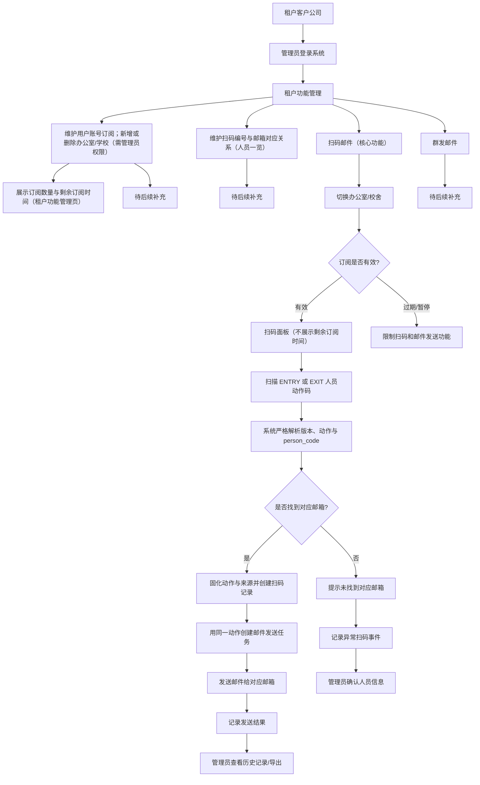

# 架构设计（Web SaaS, MVP）

## 1. 总体架构

- 前端：Next.js（App Router）+ TypeScript + Tailwind CSS
- 后端：NestJS（Node.js 20 LTS，REST API）
- 数据库：PostgreSQL 16 + Prisma
- 认证：JWT（access + refresh）+ RBAC
- 邮件服务：MVP 使用 Sandbox/Mock Provider（不接入真实供应商）

### 1.1 Local 容器运行拓扑（Issue #60）

- Local Compose 提供 `frontend`、`backend`、`postgres` 三个服务，用于本地一键启动与 GUI/API 黑盒验证。
- `backend` 通过 Compose 内部 DNS 使用 `postgres:5432` 连接数据库；宿主机直跑后端时仍使用 `localhost:5432`。
- 宿主机浏览器访问 `frontend` 暴露的 `http://localhost:3000`，前端客户端请求 `http://localhost:3001`。
- `backend` CORS 默认允许 `http://localhost:3000`；禁止使用 `*` 通配 origin。
- 该拓扑是本地 MVP 容器化基线，不包含 Production 域名、TLS、反向代理、负载均衡、真实 secrets 或真实邮件 provider。

### 1.2 Staging 部署控制边界（ADR-005）

- Terraform 与 cloud-init 负责主机 bootstrap；cloud-init 不克隆应用、不注入真实 secrets、不启动应用 Compose。
- 应用部署步骤由独立、幂等的部署脚本承载，并在人工批准后由操作者或 Agent 触发。
- 部署脚本落地前，`docs/staging-manual.md` 的 SSH/Compose 命令链是当前执行入口。
- 人工 Runbook 永久保留，用于脚本失败、恢复、排障和回滚。
- `workflow_dispatch` 属于后续独立 Issue；当前不启用无审批自动发布。

## 2. 前端层

- 登录页、扫码录入页、任务状态页、管理页
- 调用 `/api/*` 后端接口
- 按角色展示可见功能（普通用户/管理员）
- 登录页先输入 10 位公开 `tenant_code`，再输入“用户名/邮箱”与密码；不接受或展示 tenant UUID，并保留 `autocomplete=username` 供密码管理器识别

## 3. 后端层

- Auth 模块：登录、token 刷新、权限校验
- Tenant 模块：租户管理与隔离
- Subscription 模块：订阅状态与有效期校验
- Scan 模块：严格解析 `PD1|ENTRY|person_code` / `PD1|EXIT|person_code`、扫码事件入库、幂等与冲突处理
- Mail 模块：邮件任务创建、发送、重试
- Audit 模块：以 best-effort 方式写入关键操作审计日志；审计写入失败不改变主业务结果

## 4. 数据层

- 单库多租户（shared DB + tenant_id 隔离）
- 所有业务核心表包含 `tenant_id`
- 查询默认附带 tenant scope，防止越权读取
- tenant scope 来源于认证后的登录用户上下文，禁止直接使用前端传入的 `tenant_id`
- tenant UUID 继续作为内部主外键；登录入口仅用全局唯一 `tenant_code` 定位 tenant，解析后才用内部 UUID 查询用户并签发 session/token
- location 保留 UUID 主键和所有历史外键；客户 API/UI 使用 tenant-scoped 的 8 位 Crockford Base32 `location_code`。共享访问层先按 token tenant 与 assignment 解析业务码，再用内部 UUID 查询或写入关联表
- location 技术类型固定为 `location`。办公室、学校等未来分类不得复用 `type`，需要独立 ADR 与 `category` 字段
- ADR-011 将人员与地点的删除建模为 `active|inactive -> pending_delete -> purged`。前两种状态进入
  `pending_delete` 时保存原状态和数据库计算的 14 天期限；期限内可原子恢复，后台清理器到期后把当前
  PII 匿名化并写审计。扫码、邮件和审计历史及其发送时快照不被级联删除

## 5. 认证与授权

- MVP 使用账号密码登录
- 登录入参包含 `tenant_code + identifier + password`。含 `@` 的 identifier 只按规范邮箱查询，不含 `@`
  的 identifier 只按本 tenant operator 用户名查询，不执行跨字段回退
- operator 必须有 tenant 内唯一的小写 ASCII username，邮箱可空；tenant_manager 必须有 tenant 内唯一邮箱且
  username 为空。身份字段不能改变数据库记录中的角色
- tenant_code 不存在、身份不存在、账号停用或密码错误统一返回 `LOGIN_FAILED`；不存在身份仍执行伪 Argon2
  校验。登录尝试按 IP、tenant hash、identifier hash 及组合维度限流，日志不记录原始身份
- token 中包含 user_id / tenant_id / role
- 后端通过 `JwtAuthGuard` 解析 token，并在请求上下文注入 `tenant_id`、`user_id`、`role`
- Controller 使用统一的 `@CurrentUser()` 获取认证上下文，业务层不得从 body/query/path 中信任前端传入的 `tenant_id`
- MVP 提供最小角色判断能力：`@Roles('tenant_manager', 'operator')` + `RolesGuard`
- 基于最小 RBAC 执行接口级权限控制
- ADR-006 已 Accepted：`tenant_manager` 管理自身 tenant 的 `operator`、location 与租户内数据，`operator` 维护人员映射与扫码；平台操作由未来独立实现的 tenantless `platform_admin` 承担
- operator 的 location 权限来自 `operator_location_assignments` 显式绑定。共享 `LocationAccessService` 把 token tenant、operator user ID 与 assignment 关系组合为统一数据库过滤条件，供 locations、people、scan、history、mail job 与 unmapped case 复用
- assignment 不写入 JWT、不做进程缓存；每个新业务请求都在数据库查询中包含 assignment 关系，因此撤销后立即阻止新的扫码、映射写入、历史读取与异常处理。只有 `tenant_manager` 可绕过 assignment，但仍强制 tenant scope
- 用户生命周期模块只查询 token tenant 下的 `operator`；创建与重置使用 Argon2 哈希，登录身份修改、
  禁用或重置同步撤销活动会话，且不允许把任何账号提升为或修改 `tenant_manager`
- 登录成功后，tenant scope 以后端会话/token 中的 `tenant_id` 为准，业务接口不允许越权切换 tenant
- 浏览器认证使用 `HttpOnly + SameSite=Lax` Cookie；Production 同时启用 `Secure`。access token 为 15 分钟，refresh token 为 7 天并逐次轮换，数据库仅保存 refresh token 的 SHA-256 哈希，允许多设备独立会话

## 6. 邮件服务集成

- 抽象邮件发送 provider 接口（便于后续替换 SMTP/第三方）
- MVP 默认启用 Sandbox/Mock provider，仅记录请求与回执，不实际投递
- 保存发送请求与回执状态
- 扫码事务提交后同步调用 sandbox provider；失败任务由进程内轮询器原子领取，按 30 秒、2 分钟、10 分钟退避，三次重试耗尽后标记为终态 `failed`
- 每个映射扫码事件保存 `person_mapping_id`、`person_code_snapshot`、`action` 与 `action_source`；邮件任务同时保存 person/location/tenant 外键及发送时的名称/人员码/动作快照。历史读取和重试使用快照及已固化正文，不因后续改名或扫描而改变。

## 7. 租户模型

- tenant 为一级隔离边界
- user、device、scan_event、mail_job 均归属 tenant
- 审计日志保留 tenant、actor、resource、result 与脱敏元数据；禁止密码、JWT、完整邮箱、邮件正文和 provider secret

## 8. 订阅模型

- subscription 与 tenant 一对一（MVP）
- 关键字段：plan、status、start_at、end_at
- MVP 仅使用 subscription 的状态与到期时间执行扫码和邮件发送安全门禁，不实施
  location/person 商业配额、价格、付款或 proration
- 未来商业计费由 P3/Future Issue #102 独立规划；除价格展示、收费、支付、发票和结算外，
  任何 MVP 功能不得依赖该 Issue
- API 请求进入业务前先执行 license check
- `status` 枚举统一为：`trial` / `active` / `expired` / `suspended`
- 仅 `trial`、`active` 允许扫码与邮件发送；重试期间若变为 `expired`、`suspended`，任务安全终止为 `failed`

## 9. 安全原则

- 最小权限原则（least privilege）
- 默认拒绝跨租户访问
- operator-location 授权默认拒绝：迁移不为旧 operator 回填任何地点，客户端 location ID 不能扩大服务端关系过滤条件
- 敏感数据脱敏日志
- 密钥与配置通过环境变量注入
- 审计登录成功/失败、角色或跨租户拒绝、订阅拒绝、未映射扫码、扫码成功与 sandbox 发送成功/失败
- 同租户、同地点、同解析后 `person_code`、同动作在 10 秒内重复提交时，通过数据库事务 advisory lock 返回原 scan event/mail job，并标记 `deduplicated=true`；相反动作返回 `SCAN_ACTION_CONFLICT`
- 客户端可为提交附带 `Idempotency-Key`；服务端只保存 key 与规范请求内容的 SHA-256 哈希，并在 24 小时内重放原 scan event/mail job，禁止同 key 绑定不同动作或人员
- 浏览器按用户本地时区显示时间；数据库、API 与导出使用 UTC
- 平台管理员角色边界已由 ADR-006 接受；本次仅迁移租户角色，平台级运行时权限仍由后续 Issue 实现
- 扫码与邮件任务历史读取始终从 JWT 获取 tenant scope，并使用 `created_at + id` 复合游标稳定分页
- 12 位 `person_code` 仅是公开定位符：服务端生成、数据库全局唯一；解析仍必须同时限定 JWT tenant 与当前 location，不能作为认证或授权依据
- 新人员的 `person_code` 是动作码内的公开定位符；扫码写接口只接受 ADR-008 的两张人员动作码，不接受裸 `person_code`、旧 `scan_code`、人工动作选择或按日次数推断
- 既有扫码和邮件记录的动作标记为 `unknown` / `legacy_unknown`，历史查询不对旧数据反推进入或离开
- 未映射扫码使用独立 `unmapped_scan_cases` 处理状态；修正映射与历史邮件重发解耦，当前不自动补发
- 待删除地点立即停止扫码、人员写入、assignment 新增和 queued 邮件；历史读取仍按 tenant 与现有
  operator assignment 授权。地点终结清理优先级高于其人员各自的期限，并撤销 operator assignments

## 10. 核心业务流程



## 11. 扫码邮件正文固定模板（MVP）

MVP 阶段邮件正文由后端根据动作码中的动作生成，不接收前端自定义正文，也不根据每日次数或历史状态推断动作。固定模板如下：

```text
entry:
{tenant_name}，{location_name}からのお知らせ：{person_name}　さんは　{time_stamp}　に入室しました。

exit:
{tenant_name}，{location_name}からのお知らせ：{person_name}　さんは　{time_stamp}　に退室しました。
```

变量来源：

- `{tenant_name}`：租户公司名
- `{location_name}`：当前办公室/学校名
- `{person_name}`：扫码编号对应人员姓名
- `{time_stamp}`：该次进入或离开动作的接收时间，格式为 `yyyymmddhhmmss`

说明：用户自定义邮件文本为后续扩展，不在当前 MVP 范围内。
