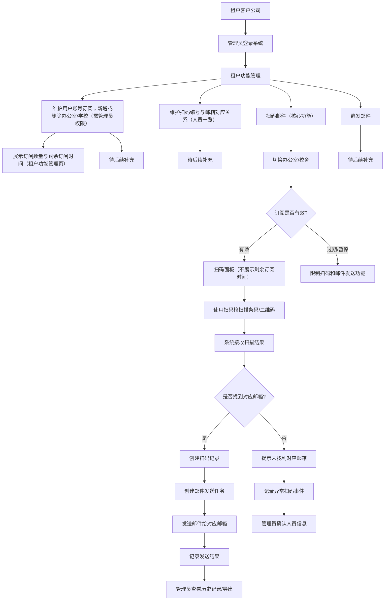

# 架构设计（Web SaaS, MVP）

## 1. 总体架构

- 前端：Next.js（App Router）+ TypeScript + Tailwind CSS
- 后端：NestJS（Node.js 20 LTS，REST API）
- 数据库：PostgreSQL 16 + Prisma
- 认证：JWT（access + refresh）+ RBAC
- 邮件服务：MVP 使用 Sandbox/Mock Provider（不接入真实供应商）

### 1.1 Local 容器运行拓扑（Issue #60）

- Local Compose 提供 `frontend`、`backend`、`postgres` 三个服务，用于本地一键启动与 GUI/API 黑盒验证。
- `backend` 通过 Compose 内部 DNS 使用 `postgres:5432` 连接数据库；宿主机直跑后端时仍使用 `localhost:5432`。
- 宿主机浏览器访问 `frontend` 暴露的 `http://localhost:3000`，前端客户端请求 `http://localhost:3001`。
- `backend` CORS 默认允许 `http://localhost:3000`；禁止使用 `*` 通配 origin。
- 该拓扑是本地 MVP 容器化基线，不包含 Production 域名、TLS、反向代理、负载均衡、真实 secrets 或真实邮件 provider。

### 1.2 Staging 部署控制边界（ADR-005）

- Terraform 与 cloud-init 负责主机 bootstrap；cloud-init 不克隆应用、不注入真实 secrets、不启动应用 Compose。
- 应用部署步骤由独立、幂等的部署脚本承载，并在人工批准后由操作者或 Agent 触发。
- 部署脚本落地前，`docs/staging-manual.md` 的 SSH/Compose 命令链是当前执行入口。
- 人工 Runbook 永久保留，用于脚本失败、恢复、排障和回滚。
- `workflow_dispatch` 属于后续独立 Issue；当前不启用无审批自动发布。

## 2. 前端层

- 登录页、扫码录入页、任务状态页、管理页
- 调用 `/api/*` 后端接口
- 按角色展示可见功能（普通用户/管理员）
- 登录页先输入 `tenant_id`，再输入用户名/密码

## 3. 后端层

- Auth 模块：登录、token 刷新、权限校验
- Tenant 模块：租户管理与隔离
- Subscription 模块：订阅状态与有效期校验
- Scan 模块：扫码事件入库、幂等处理
- Mail 模块：邮件任务创建、发送、重试
- Audit 模块：关键操作审计日志

## 4. 数据层

- 单库多租户（shared DB + tenant_id 隔离）
- 所有业务核心表包含 `tenant_id`
- 查询默认附带 tenant scope，防止越权读取
- tenant scope 来源于认证后的登录用户上下文，禁止直接使用前端传入的 `tenant_id`

## 5. 认证与授权

- MVP 使用账号密码登录
- 登录入参包含 `tenant_id + username(email) + password`
- 登录校验顺序：先校验 `tenant_id` 是否存在，再校验用户是否属于该 tenant 且密码正确
- token 中包含 user_id / tenant_id / role
- 后端通过 `JwtAuthGuard` 解析 token，并在请求上下文注入 `tenant_id`、`user_id`、`role`
- Controller 使用统一的 `@CurrentUser()` 获取认证上下文，业务层不得从 body/query/path 中信任前端传入的 `tenant_id`
- MVP 提供最小角色判断能力：`@Roles('root_admin', 'manager')` + `RolesGuard`
- 基于最小 RBAC 执行接口级权限控制
- 角色边界：`root_admin` 可维护用户账号、订阅、办公室/学校；`manager` 仅可维护人员一览与执行扫码流程
- 登录成功后，tenant scope 以后端会话/token 中的 `tenant_id` 为准，业务接口不允许越权切换 tenant

## 6. 邮件服务集成

- 抽象邮件发送 provider 接口（便于后续替换 SMTP/第三方）
- MVP 默认启用 Sandbox/Mock provider，仅记录请求与回执，不实际投递
- 保存发送请求与回执状态
- 支持失败重试与死信标记（后续扩展）

## 7. 租户模型

- tenant 为一级隔离边界
- user、device、scan_event、mail_job 均归属 tenant
- 审计日志保留 tenant 与 operator 信息

## 8. 订阅模型

- subscription 与 tenant 一对一（MVP）
- 关键字段：plan、status、start_at、end_at
- 计费策略：MVP 采用“租户基础套餐 + location 数量扩展位”（不拆分 location 级订阅）
- 追加 location 时采用同周期对齐：新增配额与当前 `end_at` 对齐，按剩余周期补差计费（proration）
- API 请求进入业务前先执行 license check
- `status` 枚举统一为：`trial` / `active` / `expired` / `suspended`
- 仅 `trial`、`active` 允许扫码与邮件发送；`expired`、`suspended` 必须在业务入口拒绝

## 9. 安全原则

- 最小权限原则（least privilege）
- 默认拒绝跨租户访问
- 敏感数据脱敏日志
- 密钥与配置通过环境变量注入
- 审计关键写操作（登录失败、权限拒绝、发送失败）

## 10. 核心业务流程



## 11. 扫码邮件正文固定模板（MVP）

MVP 阶段邮件正文由后端系统生成，不接收前端自定义正文。固定模板如下：

```text
{tenant_name}，{location_name}からのお知らせ：{person_name}　さんは　{time_stamp}　に入室しました。
```

变量来源：

- `{tenant_name}`：租户公司名
- `{location_name}`：当前办公室/学校名
- `{person_name}`：扫码编号对应人员姓名
- `{time_stamp}`：入室时间，格式为 `yyyymmddhhmmss`

说明：用户自定义邮件文本为后续扩展，不在当前 MVP 范围内。
