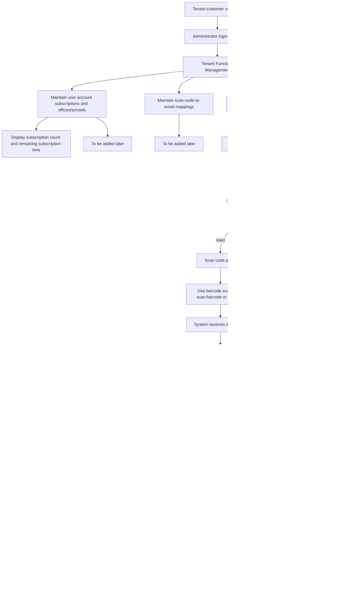

# Architecture design (Web SaaS, MVP)

## 1. Overall architecture

- Front-end: Next.js (App Router) + TypeScript + Tailwind CSS
- Backend: NestJS (Node.js 20 LTS, REST API)
- Database: PostgreSQL 16 + Prisma
- Authentication: JWT (access + refresh) + RBAC
- Email service: MVP uses Sandbox/Mock Provider (not connected to the real provider)

## 2. Front-end layer

- Login page, scan code entry page, task status page, management page
- Call `/api/*` backend interface
- Display visible functions by role (ordinary users/admins)
- On the login page, first enter `tenant_id`, then enter username/password

## 3. Backend layer

- Auth module: login, token refresh, permission verification
- Tenant module: tenant management and isolation
- Subscription module: Subscription status and validity period verification
- Scan module: Scan code event storage, idempotent processing
- Mail module: create, send, and retry email tasks
- Audit module: key operation audit log

## 4. Data layer

- Single database with multiple tenants (shared DB + tenant_id isolation)
- All business core tables contain `tenant_id`
- Query comes with tenant scope by default to prevent unauthorized reading
- tenant scope comes from the authenticated login user context, and it is prohibited to directly use the `tenant_id` passed in from the front end.

## 5. Authentication and Authorization

- MVP uses account and password to log in
- Login parameters include `tenant_id + username(email) + password`
- Login verification sequence: first verify whether `tenant_id` exists, then verify whether the user belongs to the tenant and the password is correct
- The token contains user_id / tenant_id / role
- Perform interface-level permission control based on RBAC
- Role boundary: `root_admin` can maintain user accounts, subscriptions, offices/schools; `manager` can only maintain personnel overview and execute the scanning process
- After successful login, the tenant scope is based on the `tenant_id` in the back-end session/token. The business interface does not allow unauthorized switching of tenants.

## 6. Email service integration

- Abstract email sending provider interface (facilitates subsequent replacement of SMTP/third parties)
- MVP enables the Sandbox/Mock provider by default and only records requests and receipts without actual delivery.
- Save sending request and receipt status
- Supports failed retries and dead letter marking (subject to expansion)

## 7. Tenant model

- tenant is the first-level isolation boundary
- user, device, scan_event, and mail_job all belong to tenant
- Audit log retains tenant and operator information

## 8. Subscription model

- one-to-one subscription and tenant (MVP)
- Key fields: plan, status, start_at, end_at
- Billing strategy: MVP adopts "tenant basic package + location quantity expansion bits" (without splitting location-level subscriptions)
- When adding a location, the same cycle alignment is used: the new quota is aligned with the current `end_at`, and the remaining cycle difference is billed (proration)
- Execute license check before API request enters the business
- `status` enumerations are unified into: `trial` / `active` / `expired` / `suspended`
- Only `trial` and `active` are allowed to scan QR codes and send emails; `expired` and `suspended` must be rejected at the business entrance

## 9. Security Principles

- Principle of least privilege (least privilege)
- Cross-tenant access is denied by default
- Sensitive data desensitization logs
- Keys and configurations are injected through environment variables
- Audit key write operations (login failure, permission denial, sending failure)

## 10. Core business processes



## 11. Scan code email text fixed template (MVP)

The email body in the MVP stage is generated by the back-end system and does not accept front-end custom bodies. The fixed template is as follows:

```text
Notice from {tenant_name}, {location_name}: {person_name} completed the action at {time_stamp}.
```

Variable source:

- `{tenant_name}`: tenant company name
- `{location_name}`: current office/school name
- `{person_name}`: The name of the person corresponding to the scanned code number
- `{time_stamp}`: room entry time, in the format of `yyyymmddhhmmss`

Note: User-defined email text is a subsequent extension and is not within the scope of the current MVP.
