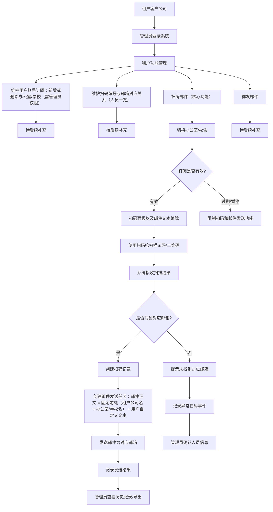

# 架构设计（Web SaaS, MVP）

## 1. 总体架构

- 前端：Web 应用（浏览器访问）
- 后端：REST API 服务
- 数据库：数据存储方案待技术栈 ADR 最终确认（可为关系型或 NoSQL）
- 认证：基于 token/session 的认证与授权
- 邮件服务：通过 SMTP 或第三方邮件 API 发送

## 2. 前端层

- 登录页、扫码录入页、任务状态页、管理页
- 调用 `/api/*` 后端接口
- 按角色展示可见功能（普通用户/管理员）

## 3. 后端层

- Auth 模块：登录、token 刷新、权限校验
- Tenant 模块：租户管理与隔离
- Subscription 模块：订阅状态与有效期校验
- Scan 模块：扫码事件入库、幂等处理
- Mail 模块：邮件任务创建、发送、重试
- Audit 模块：关键操作审计日志

## 4. 数据层

- 单库多租户（shared DB + tenant_id 隔离）
- 所有业务核心表包含 `tenant_id`
- 查询默认附带 tenant scope，防止越权读取

## 5. 认证与授权

- MVP 使用账号密码登录
- token 中包含 user_id / tenant_id / role
- 基于 RBAC 执行接口级权限控制

## 6. 邮件服务集成

- 抽象邮件发送 provider 接口（便于替换 SMTP/第三方）
- 保存发送请求与回执状态
- 支持失败重试与死信标记（后续扩展）

## 7. 租户模型

- tenant 为一级隔离边界
- user、device、scan_event、mail_job 均归属 tenant
- 审计日志保留 tenant 与 operator 信息

## 8. 订阅模型

- subscription 与 tenant 一对一（MVP）
- 关键字段：plan、status、start_at、end_at
- API 请求进入业务前先执行 license check

## 9. 安全原则

- 最小权限原则（least privilege）
- 默认拒绝跨租户访问
- 敏感数据脱敏日志
- 密钥与配置通过环境变量注入
- 审计关键写操作（登录失败、权限拒绝、发送失败）

## 10. 核心业务流程（Mermaid）

