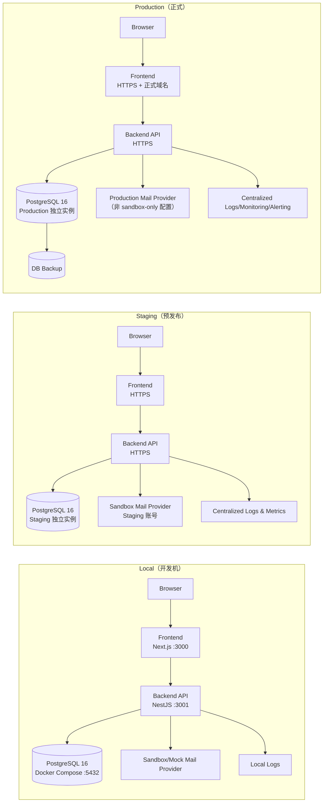

# 基础设施总览（Local / Staging / Production）

## 1. 目标

本文维护 Local、Staging、Production 三套环境的基础设施蓝图与隔离边界，确保：

- 环境隔离规则明确，避免跨环境误操作。
- 前后端、数据库、邮件 provider、日志监控、Secrets 的部署位置统一。
- 后续部署与配置类 Issue 有清晰拆分依据。

## 2. 基础设施总览图

## 3. 组件部署位置

- Frontend：
  - Local：开发机进程或 Compose 容器。
  - Staging：当前为 OCI 单 VM 上的独立 Compose 容器，经 Nginx 反向代理访问。
  - Production：目标为独立部署单元，可与后端分开发布。
- Backend API：
  - Local：开发机进程或 Compose 容器。
  - Staging：当前为同一 OCI VM 上的独立 Compose 容器，负责租户鉴权、订阅门禁和邮件任务。
  - Production：目标为独立部署单元。
- PostgreSQL：
  - Local：Docker Compose 本地容器。
  - Staging：当前为 Staging VM 内的 PostgreSQL 16 容器，仅使用合成测试数据；不与 Production 共用。
  - Production：独立数据库实例，用于真实业务数据，包含备份策略。
- Mail Provider：
  - Local：mock/sandbox。
  - Staging：sandbox（禁止真实客户投递）。
  - Production：正式发送链路（不能使用 mock secret 或 sandbox-only 配置）。
- 日志/监控：
  - Local：控制台/本地日志。
  - Staging/Production：集中式日志与指标，Production 需告警。
- Secrets：
  - 三环境独立存储，禁止复用。

## 4. 隔离原则

1. Staging 与 Production 必须：
   - 独立数据库实例。
   - 独立 Secrets。
   - 独立环境变量集合。
2. Staging 不使用真实客户数据。
3. Production 不使用 mock secret 或 sandbox-only mail 配置。
4. 禁止跨环境共享访问凭据（如同一 `DATABASE_URL` / `JWT_SECRET`）。

## 5. Issue #35 历史范围

Issue #35 只负责基础设施设计，当时不包含以下实现；后续 Issue 已完成其中部分内容，本节仅用于历史追溯，不代表当前仓库状态：

- 创建 AWS/Vercel/RDS/ECS 等真实云资源。
- 编写 Docker Compose 实现文件。
- 建立 CI/CD 流水线实现。
- 接入真实邮件供应商 SDK/API。

## 6. 当前待补强项

Local Compose、Staging IaC 与人工批准的 Compose 部署 Runbook 已经落地。当前仍需补强：

1. 按 ADR-005 实现 Staging 幂等部署脚本，并保持人工审批触发。
2. Staging/Production secrets 管理规范落地。
3. Staging 与 Production HTTPS 证书、域名和访问控制。
4. 数据库备份与恢复演练（#38）。
5. 日志、指标与告警最小可观测链路（#39）。
6. Production 发布与回滚 Runbook。

## 7. 资源台账（实际参数）

`docs/infrastructure.md` 负责基础设施蓝图与隔离原则；实际落地资源与参数请统一维护在 `docs/inventory/`：

- `docs/inventory/infrastructure-inventory.md`：基础设施资源台账
- `docs/inventory/environment-parameters.md`：环境变量参数表
- `docs/inventory/secrets-inventory.md`：Secrets 名称与保存位置台账（不含真实值）
- `docs/inventory/external-services.md`：外部服务依赖台账
- `docs/inventory/cloud-resources-parameters.md`：云资源参数表（EC2/RDS/VPC/LB 等）

当 Local / Staging / Production 的资源、域名、端口、环境变量或外部服务发生变化时，必须同步更新以上台账。

## 8. OCI Always Free Staging IaC（Issue #48）

Issue #48 的 Staging 基础设施资源准备采用 Terraform，代码位于 `infrastructure/oci-staging/`，目标为人工已创建的 OCI compartment `Mail_project_stg`。

Issue #48 最初只生成 IaC 并等待人工确认实施。该基线后来已由人工执行，并在 2026-07-09 完成 Staging VM 重建验证；历史执行证据见 `docs/testing/staging-smoke-2026-07-07.md`。后续 apply 仍必须由人工审核，且不得提交真实 OCI 凭据、数据库密码、JWT secret 或邮件服务 token。

当前 Staging IaC 范围：

- OCI VCN / Public Subnet / Internet Gateway / Route Table，用于 Staging 网络隔离与公网 smoke test 入口。
- Web/API NSG，仅开放 SSH、HTTP、HTTPS；SSH 来源必须在人工实施前收窄为管理员固定 IP/CIDR。
- DB NSG，仅允许 Staging 子网访问 PostgreSQL `5432`，禁止公网直接访问数据库端口。
- Always Free Compute，默认使用 `VM.Standard.A1.Flex` 单机承载 MVP Staging 的 Frontend、Backend 与 PostgreSQL 16 容器。
- Object Storage Bucket，用于非真实 Staging 数据备份和运维产物归档，并配置生命周期清理。
- Cloud-init，仅安装 Docker、创建目录和占位配置，不自动部署应用、不写入真实 secrets。

人工实施前必须确认 OCI home region、Always Free 配额、`Mail_project_stg` compartment OCID、管理员 SSH CIDR 与 SSH 公钥。
